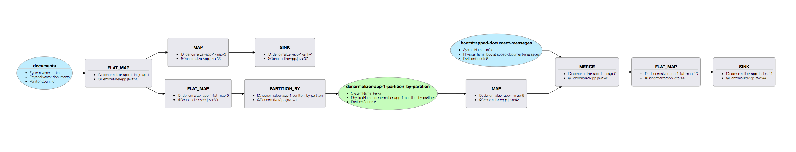

# Denormalizer

The denormalizer is the only component of EZstack that is able to write directly into Elasticsearch. It is built on top of Apache Samza is designed to run on top of Hadoop YARN.

## Inputs

The main input to the denormalizer is the `documents` Kafka stream, which is a stream of updates from EZapp.

Additionally, the denormalizer takes in deprioritized input from the `bootstrapped-documents` stream, which is a stream of documents that the bootstrapper has generated for new rules.

## Outputs

The denomalizers main output is obviously Elasticsearch, which is where it dumps documents after denormalization. 

In addition, the denormalizer checkpoints it state to Kafka using every minute. Also, every internal datastore of the denormalizer checkpoints its changes to a log-compacted Kafka stream for easy recovery in the event of failure.

## Architecture

